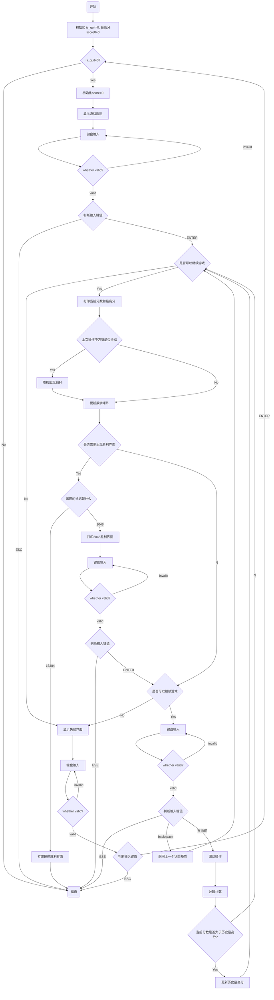

# Game2048_EGE设计文档

## 一、需求分析

用C/C++完成的2048编程游戏，实现游戏2048的基本功能，并要求有界面。

游戏的使用场景：WIN10

## 二、功能设计

### 基本设计

* 操作设计：
  * 移动方向盘的上下左右键来控制游戏，ESE退出游戏，ENTER继续游戏；
  * 每一次有效按键之后，在空白处随机出现方块2或者方块4 。
* 游戏胜利判断设计：
  * 出现2048的小方块即为游戏胜利。
  
### 特色设计

* 撤销功能设计：
  * Backspace 即可返回上一步，最多可返回200步。
* 等级色彩设计：
  * 随着得分的增加，分数显示处的字体颜色会变化；
  * 随着分数的分数增加，对应于灰赤橙黄绿青蓝紫八个等级。（具体颜色附在本模块最后）
* 继续挑战设计：
  * 在出现2048的方块之后会出现胜利界面；
  * 玩家可选择继续游戏，挑战更高的分数；
  * 终极方块为16384，出现此方块后，游戏在出现此方块之后出现胜利的界面提示，任意键退出游戏。
* 方块设计：
  * 普通的方块还原经典小游戏2048的配色；
  * 数值为2048以及更大的方块都经过特殊设计。
* 刺激升级设计：
  * 每次滑动都将消除路径上所有可以消除的方块。
* 界面：
  * 区别于原版游戏较单调的游戏界面，本游戏中采用了清新淡雅的背景。

|       Score        | Color |        RGB         |
| :----------------: | :---: | :----------------: |
|        1-10        |  灰   | RGB(205, 201, 201) |
|       11-100       |  赤   |   RGB(255, 0, 0)   |
|      101-1000      |  橙   |  RGB(255, 200, 0)  |
|     1001-10000     |  黄   |  RGB(255, 215, 0)  |
|    10001-100000    |  绿   |   RGB(0, 255, 0)   |
|   100001-1000000   |  青   | RGB(64, 224, 208)  |
|  1000001-10000000  |  蓝   |   RGB(0, 0, 255)   |
| 10000001-100000000 |  紫   | RGB(160, 32, 240)  |

## 三、程序设计

